# MATH6380O-Project 2

### Team Members

1. Zac Wellmer : resnet code, resnet tests, and report
2. Kelly Huang : expanded experiment, and report

We explore the effects of both training and test accuracy and cross entropy loss on two variations of the fashion MNIST dataset. First we construct a baseline to compare against. The baseline is the results obtained from the original dataset. We then compare to performance obtained by training on a dataset where lables are assigned based on samples from a uniform distribution. On top of this we will look at how some network parameters and hyperparameters influence this process. This is an interesting experiment because of the potential to demonstrate a neural network fitting to entirely noisey data through brute-force.

# Dataset

The dataset we will be working with is Fashion-MNIST from Zalando's article images. Fashion-MNIST contains 60,000 examples broken down to 50,000 train examples and 10,000 test examples. However, for the course of this experiment we had to shrink our training set size 10k to produce results similar to the rethinking generalization results[3]. As suggested by [3] in their torch implementation[4] inputs found in datasets like MNIST/Fashion MNIST contain images very similar in pixel space so assigning random labels makes it difficult to fit. They[4] suggest that it might be possible if training is run for many more epochs but as we do not have access to many GPUs this is not as realistic for us to test. Each example is a 28 by 28 gray scale image associated with 1 of 10 classes.

Each training and test example is assigned to one of the following labels:

0. T-shirt/top
1. Trouser
1. Pullover
1. Dress
1. Coat
1. Sandal
1. Shirt
1. Sneaker
1. Bag
1. Ankle boot

Below is a sample image of the fashion mnist dataset[1]

# Architectures

We focus our experiments on 3 different sizes of residual networks. The reason we look at 3 different sizes of residual networks is to measure the effects of model capacity on ability to brute force a dataset with randomly permuted labels

1. 50 layer resnet

2. 101 layer resnet

3. 200 layer resnet

Below is a sample image of a 34 layer residual network[1]
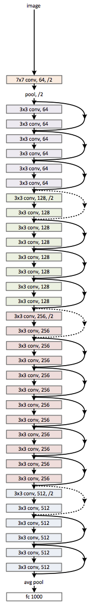

# Experiments

All graphs below were generated with the help of tensorboard[3]

We compare accuracy and cross entropy loss on resnet50, resnet 101, and resnet200 with uniform random labels and original labels.

|       orange        |        blue        |         red         |
| :-----------------: | :----------------: | :-----------------: |
| random labels train | random labels test | normal labels train |

### resnet 200 acuracy

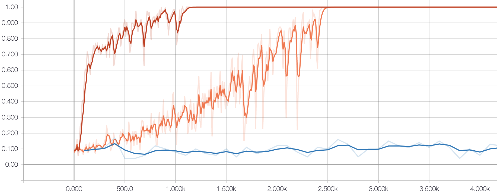

### resnet 200 cross entropy loss

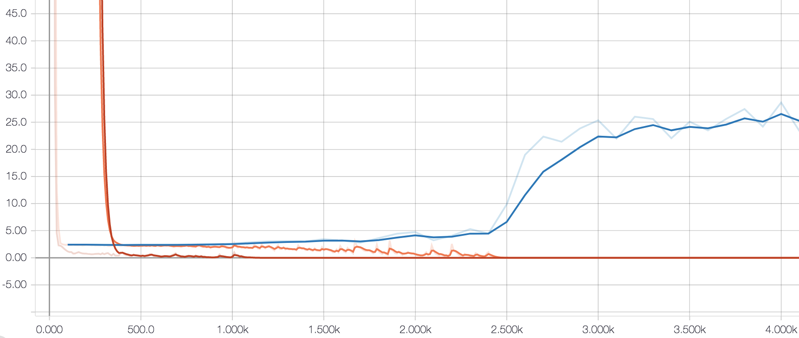

|        pink         |       green        |        gray         |
| :-----------------: | :----------------: | :-----------------: |
| random labels train | random labels test | normal labels train |

### resnet 101 acuracy

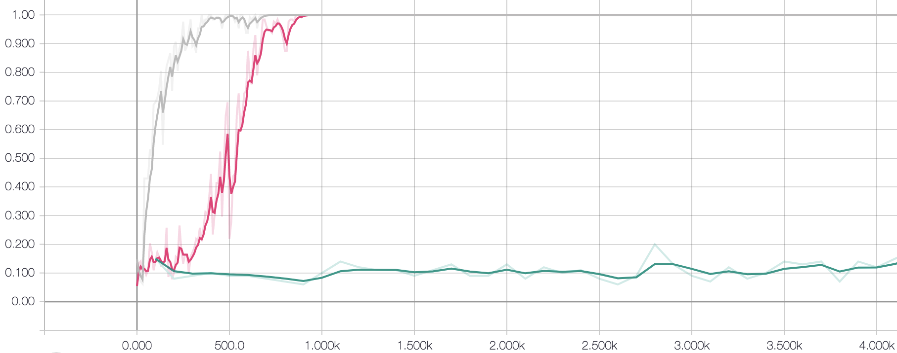

### resnet 101 cross entropy loss

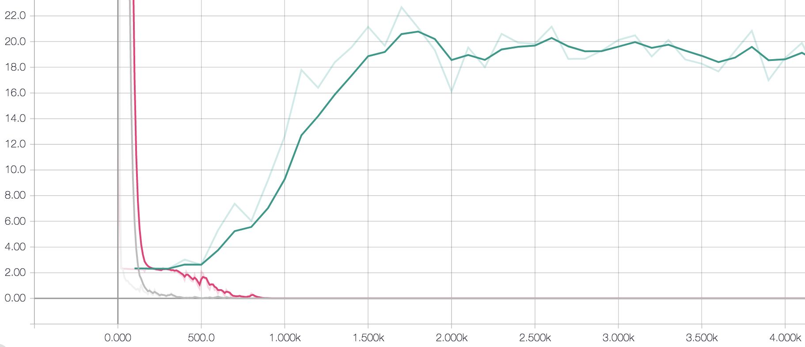

|        blue         |        red         |        cyan         |
| :-----------------: | :----------------: | :-----------------: |
| random labels train | random labels test | normal labels train |

### resnet 50 acuracy

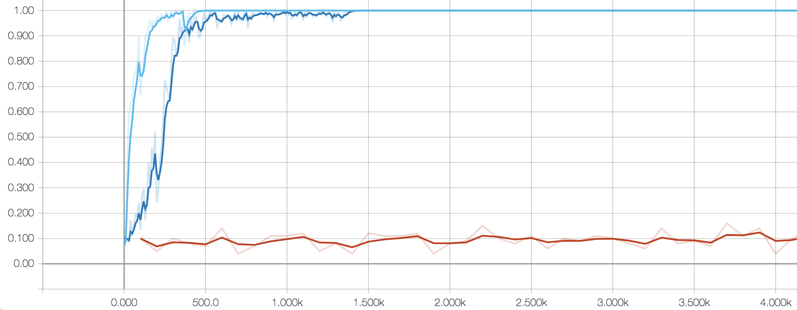

### resnet 50 cross entropy loss

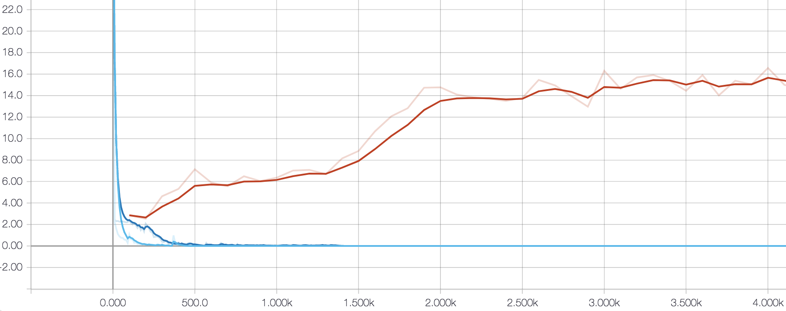

|        blue        |        pink         |       orange        |
| :----------------: | :-----------------: | :-----------------: |
| random res50 train | random res101 train | random res200 train |

### resnet random train

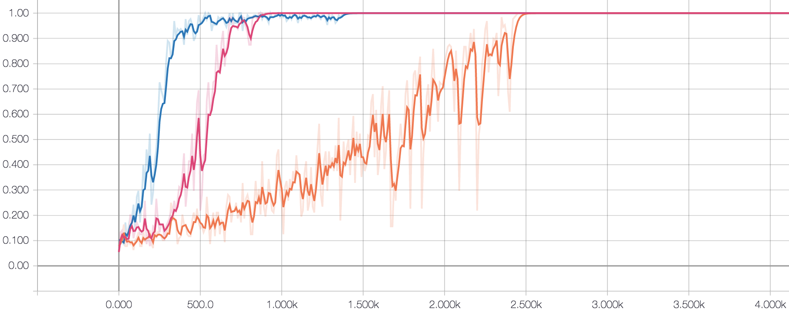

# Analysis

Unsurprisingly the originally labeled dataset is able to converge the fastest. However it is interesting to see that while the random datasets converge slower it is still entirely possible for the resnets to memorize the datasets. Intuitively we had expected that larger difficulties would arrise during training such as not being able to converge or dramatically slower convergence. But the above results suggest that this is not the case for any of the three residual network architectures we tested. In order to get our models to fit to the random noise data we did not to change any hyper parameters such as the learning rate schedule. It is also interesting to see that as soon as the fitting starts convergence happens quite quickly to exactly overfit the training data.

As mentioned by the author's of [3,4] memorizing inputs for MNIST is particularly difficute because many of the inputs are nearly identical to each other in pixel space. So assigning random labels to these similar images makes the process much more difficult than training on datasets such as CIFAR10 or random pixel inputs which contain inputs that are more spread out in pixel space. In the future it could be interesting to see if leaving this process to run for
many more epochs(on the order of hundreds) could allow for memorizing the entire Fashion MNIST da
taset. In the case of training for many more epochs on the entire dataset we might see more profound effects of higher capacity networks. In the examples we went through it seems that a smaller 50 layer resnet was easily able to memorize the dataset and did so at a much quicker pace than the higher capacity networks. We also noticed that the memorization process for the large 200 layer network had much higher variance in terms of accuracy(notice how it jumps around noticebly more than both the 50 and 101 layer). We speculate that this would not be the case when training on a larger dataset for an extended period of time with stronger compute power. This is because the larger dataset would require more parameters to be memorized.

# Extended Experiments and Analyses

After several experiments on a rather smaller size of the training set, we proceed the same training process on the whole training set sized 50000. Here are the outcomes:
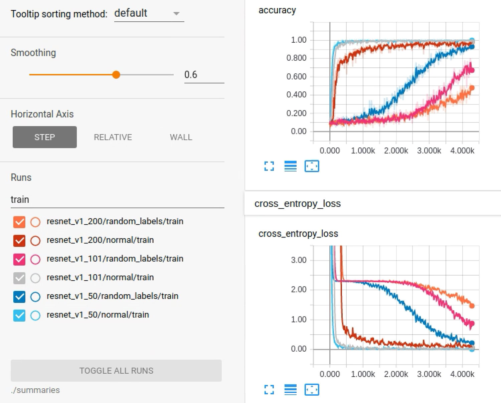
The normal training processes show when memorizing the correct labels of the training set, it is comparatively much more faster. Also with more parameters, it takes more epochs.
Nontheless, while comparing with normal trainings, approching none-zero loss is quite a harder way to go. As we run the random-labeled experiments for 50000 epochs, they still haven't reached none-zero loss.
But institutively, still, the less the parameters, the faster the loss-epoch curve declines.
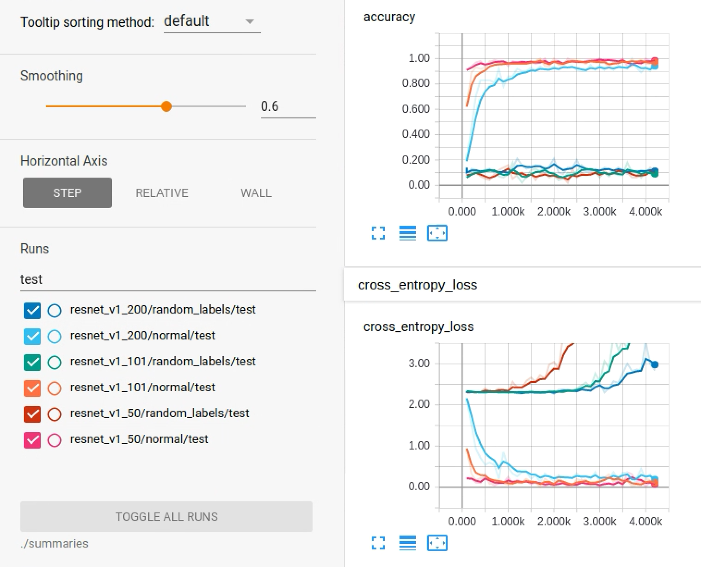
Above curves show given enough training epochs, the model can still memorize all the input "knowledge", though with these "knowledge" they almost cannot figure out the test labels at all(the test accuracy curves float around 0.1). But importantly, it is proved as above and here, as stated in [2] and [3], memorizing false labels, which needs more trainings and "memorizing", is indeed possible as the same with memorizing true labels, so it is called residual learning.
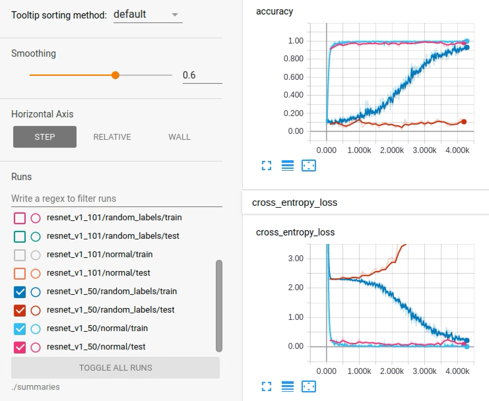
To summarize, using residual learning or rethinking generaliztion, is not aimed to train a network model for directly classification or some else learning and working purpose. It shows another approach to dig the learning ability of a parameterized network. This ability is reflected by forcing the training label totally shuffled from original classes. And by simple notification that some nearly identical training images are forcely tagged with different labels, or reversively speaking, that different labels are projected into very similar positions in pixel space, we can tell that such a residual network has such potention of **residual learning ability**.

# References

1. Fashion MNIST https://www.kaggle.com/zalando-research/fashionmnist
2. Deep Residual Learning for Image Recognition https://arxiv.org/abs/1512.03385
3. Understanding deep learning requires rethinking generalization https://arxiv.org/abs/1611.03530
4. https://github.com/pluskid/fitting-random-labels
